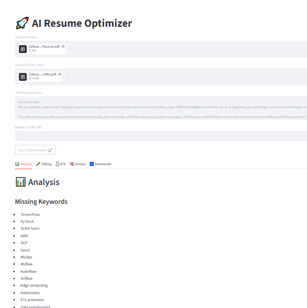
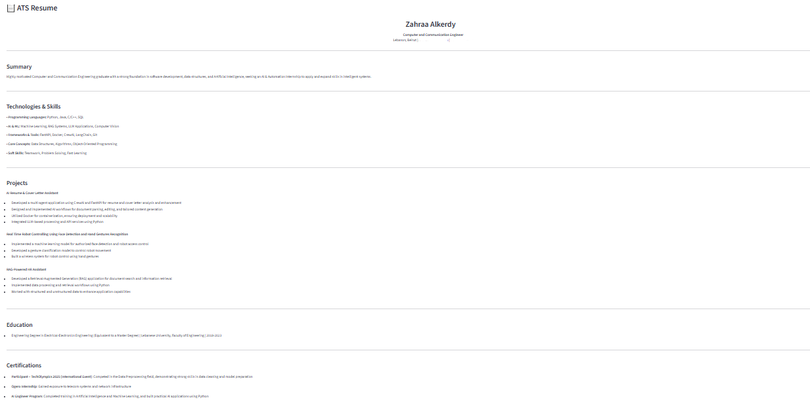

# 🚀 AI Resume & Cover Letter Optimizer

An AI-powered application that analyzes resumes and cover letters, improves their content, optimizes them for Applicant Tracking Systems (ATS), and generates professional downloadable outputs.

Built using **CrewAI**, **FastAPI**, **Streamlit**, **Docker**, and **LLMs**.

---

## Quick Access

* 🌐 Live Demo: https://resume-optimizer-ui-17go.onrender.com/
* 🐙 GitHub Repository: https://github.com/Zahraa-Alkerdi/AI-Resume-Application

---

## 📌 Overview

Applying for jobs often requires tailoring resumes and cover letters to specific job descriptions.

This application automates that process using a multi-agent AI workflow that:

* Analyzes a resume against job requirements
* Identifies missing keywords and gaps
* Reviews GitHub projects (optional)
* Improves and restructures the resume
* Generates an ATS-optimized version
* Reviews the final result
* Produces downloadable PDF and DOCX files

The goal is to help students, graduates, and job seekers create stronger applications while saving time.

---

## ✨ Features

### Resume Analysis

* Detects missing keywords
* Highlights strengths and weaknesses
* Finds mismatches with job requirements
* Provides improvement suggestions

### GitHub Portfolio Analysis

* Reviews public repositories
* Detects technologies and frameworks used
* Extracts relevant project information
* Helps showcase real technical experience

### Resume Enhancement

* Improves clarity and readability
* Reorganizes content
* Preserves factual information
* Enhances ATS compatibility

### ATS Optimization

* Generates structured ATS-friendly resumes
* Optimizes keyword placement
* Improves recruiter readability

### Review & Scoring

* ATS compatibility score
* Overall application score
* Actionable recommendations

### Export Options

* Download ATS Resume as PDF
* Download ATS Resume as DOCX
* Download ATS Cover Letter as PDF
* Download ATS Cover Letter as DOCX
* Download everything as ZIP

---

## 🏗️ Architecture

The application uses a multi-agent workflow powered by CrewAI:

1. **Analyzer Agent**

   * Analyzes resume, cover letter, and job requirements

2. **GitHub Analyzer Agent**

   * Reviews GitHub repositories
   * Extracts verified technologies and projects

3. **Editor Agent**

   * Improves resume and cover letter
   * Preserves factual information

4. **ATS Optimization Agent**

   * Generates ATS-friendly structured output

5. **Reviewer Agent**

   * Evaluates final quality and ATS readiness

---

## 🛠️ Tech Stack

### Backend

* Python
* FastAPI
* CrewAI
* Groq LLM
* PyMuPDF
* python-docx

### Frontend

* Streamlit

### Deployment

* Docker
* Render

---

## 📂 Project Structure

```text
project/
│
├── backend/
│   ├── crew.py
│   ├── main.py
│   ├── schemas.py
│   ├── Dockerfile
│   ├── tools/
│   └── config/
│
├── frontend/
│   ├── streamlit_app.py
│   ├── Dockerfile
│   └── requirements.txt
│    
├── docker-compose.yml
└── README.md
```

---
## 📸 Screenshots

### Resume Analysis



### ATS Resume Output



---
## 🚀 Running Locally

### 1. Clone the repository

```bash
git clone https://github.com/Zahraa-Alkerdy/AI-Resume-Application.git
cd your-repository
```

### 2. Create a virtual environment

```bash
python -m venv .venv
```

### 3. Activate the environment

Windows:

```bash
.venv\Scripts\activate
```

Linux / Mac:

```bash
source .venv/bin/activate
```

### 4. Install dependencies

```bash
pip install -r requirements.txt
```

### 5. Configure environment variables

Create a `.env` file:

```env
GROQ_API_KEY=your_key_here
MODEL=groq/llama-3.3-70b-versatile
```

### 6. Run FastAPI

```bash
uvicorn backend.main:app --reload
```

### 7. Run Streamlit

```bash
streamlit run frontend/streamlit_app.py
```

---

## 🐳 Run Locally with Docker (Optional)

Build and run:

```bash
docker compose up --build
```

---

## 📖 How to Use

1. Upload a resume (PDF or DOCX)
2. Upload a cover letter (PDF or DOCX)
3. Paste the target job requirements
4. Optionally provide a GitHub profile URL
5. Click **Run AI Optimization**
6. Review:

   * Analysis
   * Edited Resume
   * ATS Resume
   * Review Scores
7. Download the generated files

---

## 🎯 Intended Users

* Students
* Fresh graduates
* Internship applicants
* Junior software engineers
* AI and ML enthusiasts
* Job seekers wanting ATS-friendly resumes

---

## 🔮 Future Improvements

* LinkedIn profile analysis
* Multiple resume templates
* Multi-language support
* Cloud storage integration


---

## 📜 License

This project is available for educational, learning, and portfolio purposes.

Feel free to explore, fork, and adapt the project for personal use.
---

## 👩‍💻 Author

**Zahraa Alkerdy**

Computer & Communication Engineer

Passionate about Artificial Intelligence, Machine Learning, LLM Applications, and AI Automation Systems.
